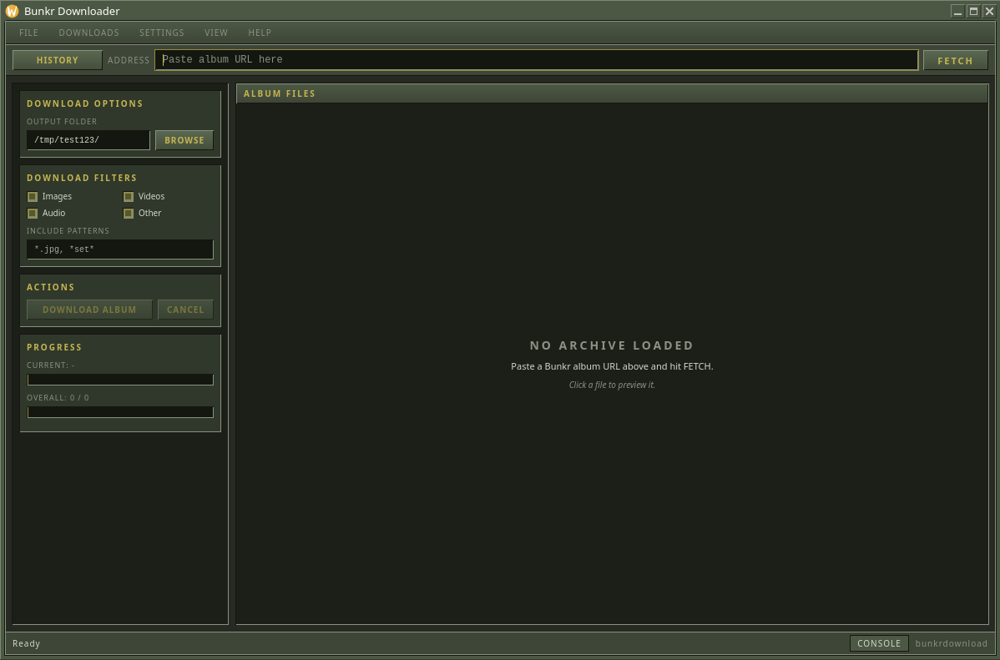

# Bunkr Download




Small Wails app for scraping Bunkr albums and downloading files. UI mimics
old Steam since I like old school cool.

Paste an album URL like `https://example.invalid/album-redacted`, fetch the listing, preview
images in a separate window, pick an output folder, and download with filters.

Settings live in the usual OS config spot (`~/.config/bunkrdownload/settings.json`
on Linux). Previewed images get cached under `~/.cache/bunkrdownload/media/` and
reused when you download the same file later.

## Toolchain

Toolchain runs in a distrobox because I am running bazzite, for any other OS you can just follow the default wails developer configuration.

```bash
./scripts/init.sh    # once
./scripts/build.sh
./build/bin/bunkrdownload
```

Dev loop with hot reload:

```bash
distrobox enter wails-dev -- bash -lc 'PATH=$HOME/.local/bin:$PATH wails3 dev'
```

## Layout

```
src/          Go application (entry point, services, download logic)
frontend/     html/css/js + generated bindings
scripts/      init, build, release helpers
build/        macOS packaging metadata (Info.plist)
```

Tests: `go test ./src/...` (run inside `wails-dev` if GTK headers aren't on the host).

## Releases

Push a version tag to publish binaries for Linux, Windows, and macOS:

```bash
git tag v0.1.0
git push origin v0.1.0
```

The [Release workflow](.github/workflows/release.yml) uploads:

- `bunkrdownload-linux-amd64`
- `bunkrdownload-windows-amd64.exe`
- `bunkrdownload-macos-amd64.dmg`

All builds target 64-bit x86 (`GOARCH=amd64`).
